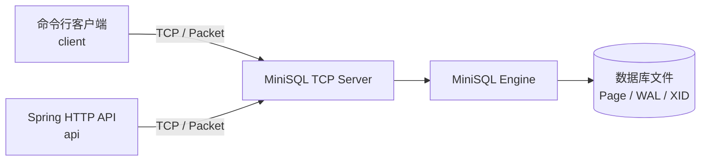

# 3. 上下文与边界

MiniSQL 的内核由 TCP server 承载；CLI 和 Spring HTTP API 都是外部适配器。HTTP API 通过 TCP 协议转发 SQL，不直接依赖 storage engine。

## 外部接口

| 接口 | 协议 | 入口 | 责任 |
|---|---|---|---|
| CLI | TCP | `client.Launcher` | 交互式 SQL shell |
| TCP server | TCP | `server.Launcher` / `Server` | socket lifecycle、每连接 Executor |
| HTTP API | HTTP / JSON | `api.MiniSqlApplication` | session 与 HTTP DTO，转发到 TCP server |
| 数据目录 | file I/O | `DatabaseManager` | database context、page、WAL、transaction status |
