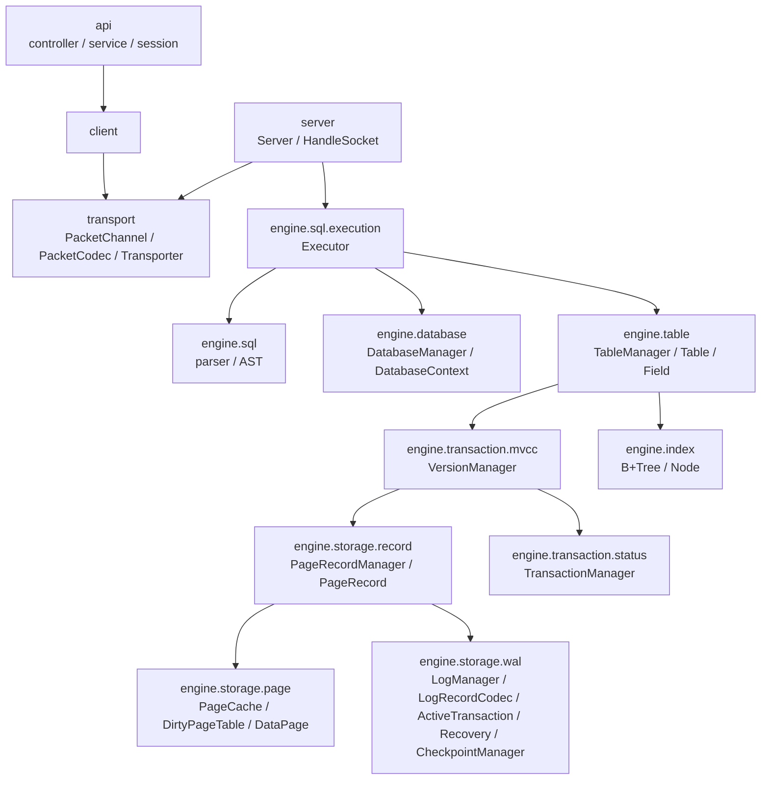

# 5. 构建块视图

## 包职责

| 包 | 核心职责 | 不应承担的职责 |
|---|---|---|
| `transport` | bytes framing、Packet encode/decode、socket read/write | SQL 与 ExecutionResult 语义 |
| `server` | 连接、线程池、每连接 Executor 生命周期 | storage details |
| `engine.sql` | SQL parser、AST、statement dispatch | Page / WAL I/O |
| `engine.database` | database context 创建、打开、引用计数与关闭 | SQL parsing |
| `engine.table` | table metadata、row 编码、DDL / DML 协调 | socket 协议 |
| `engine.transaction` | XID status、MVCC visibility、lock / deadlock coordination | Page layout |
| `engine.storage.record` | logical entry 到 physical record 的桥接、WAL record 创建 | SQL row 的字段语义 |
| `engine.storage.page` | Page cache、allocation、DirtyPageTable、dirty-page flush | transaction visibility |
| `engine.storage.wal` | typed record codec、append、durability、ATT、checkpoint、Analysis/Redo/Undo | table schema |
| `engine.index` | B+Tree node search、insert、split 与 range scan | MVCC visibility |

## 主要组装顺序

`DatabaseManager` 打开一个 database 时依次创建 `TransactionManager`、`PageRecordManager`、`VersionManager` 和 `TableManager`，并放入 `DatabaseContext`。这种 composition root 集中于 `engine.database`，避免普通业务对象自行创建底层依赖。
