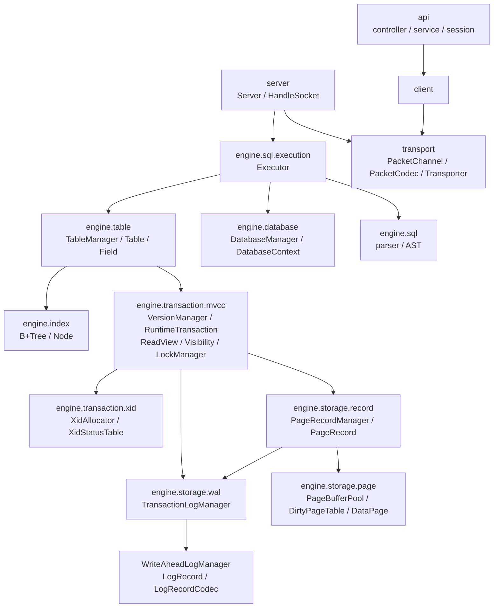

# 5. 构建块视图

## 包职责

| 包 | 核心职责 | 不应承担的职责 |
|---|---|---|
| `transport` | bytes framing、Packet encode/decode、socket read/write | SQL 与 ExecutionResult 语义 |
| `server` | 连接、线程池、每连接 Executor 生命周期 | storage details |
| `engine.sql` | SQL parser、AST、statement dispatch | Page / WAL I/O |
| `engine.database` | database context 创建、打开、引用计数与关闭 | SQL parsing |
| `engine.table` | table metadata、row 编码、DDL / DML 协调 | socket 协议 |
| `engine.transaction` | XID status、运行期事务、ReadView、MVCC visibility、lock / deadlock coordination | Page layout |
| `engine.storage.record` | logical entry 到 physical record 的桥接、PageRecord 存取与空间定位 | SQL row 和事务日志生命周期 |
| `engine.storage.page` | Page cache、allocation、DirtyPageTable、dirty-page flush | transaction visibility |
| `engine.storage.wal` | 事务日志链、typed record codec、物理 WAL、ATT、checkpoint、Analysis/Redo/Undo | table schema |
| `engine.index` | B+Tree node search、insert、split 与 range scan | MVCC visibility |

## 主要组装顺序

`DatabaseManager` 只管理 `contexts` 注册表、引用计数和 database
创建/打开/删除。`DatabaseContext.create/open` 作为 database 级 composition root，
依次组装 `XidAllocator`、`XidStatusTable`、`ActiveTransactionTable`、
`WriteAheadLogManager`、`PageBufferPool`、`TransactionLogManager`、
`CheckpointManager`、`PageRecordManager`、`VersionManager` 和 `TableManager`。
组件全部构造完成或 Recovery 结束后，才启动 PageCleaner 与
CheckpointScheduler。

`WriteAheadLogManager` 在 `PageBufferPool` 之前创建，并作为 final 构造依赖注入，
保证 WAL-before-page flush；`PageBufferPool` 不持有 `CheckpointManager`。
`CheckpointManager` 独立调度 fuzzy checkpoint，避免 PageCleaner 与 checkpoint
形成双向依赖。

`TransactionLogManager` 由 `DatabaseContext` 创建，同一个实例分别注入
`PageRecordManager` 与 `VersionManager`。`PageRecordManager` 不再暴露
`getTransactionLogManager()`，也不负责创建或关闭注入的 WAL/BufferPool；其
`create/open` 只封装 MetaPage 初始化、现有格式加载、Recovery 和 FreeSpaceMap
重建。

`TransactionLogManager` 与 `WriteAheadLogManager` 不实现共同接口，也不继承共同
基类。前者管理 xid、事务日志链和 ATT，后者管理 WAL 文件、LSN、buffer、reader 与
durability；二者共享 `LogRecord`/LSN 概念，并通过组合形成上下层关系。
