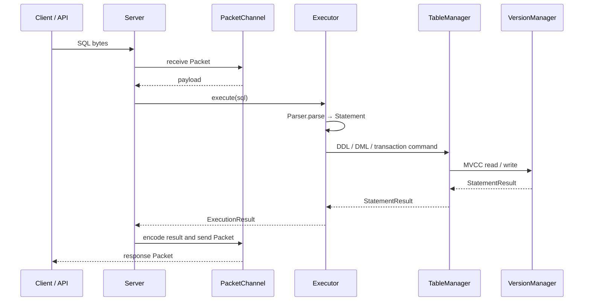
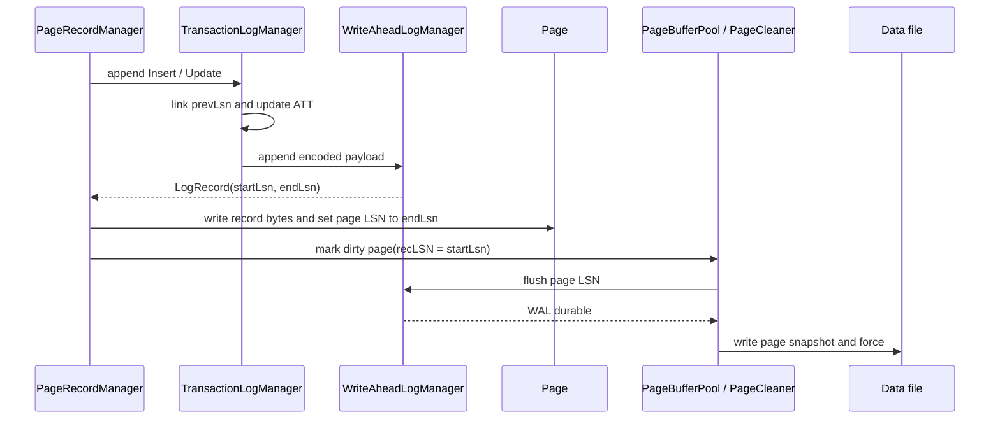
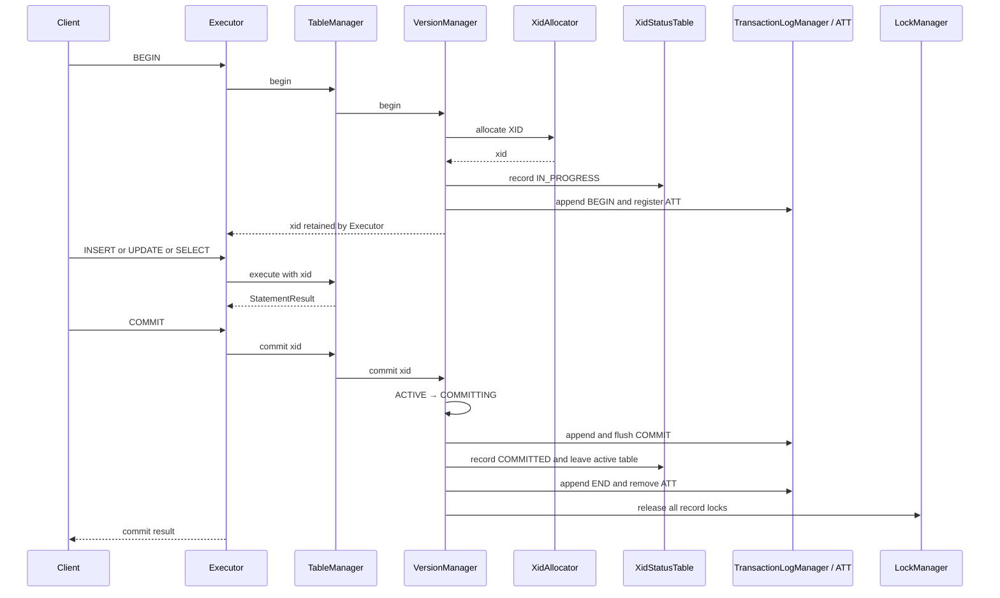
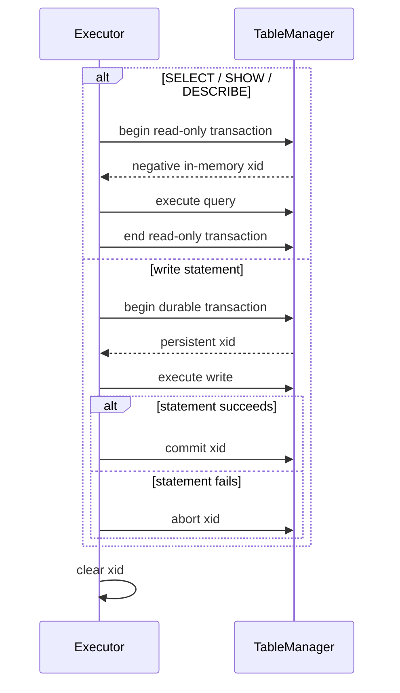
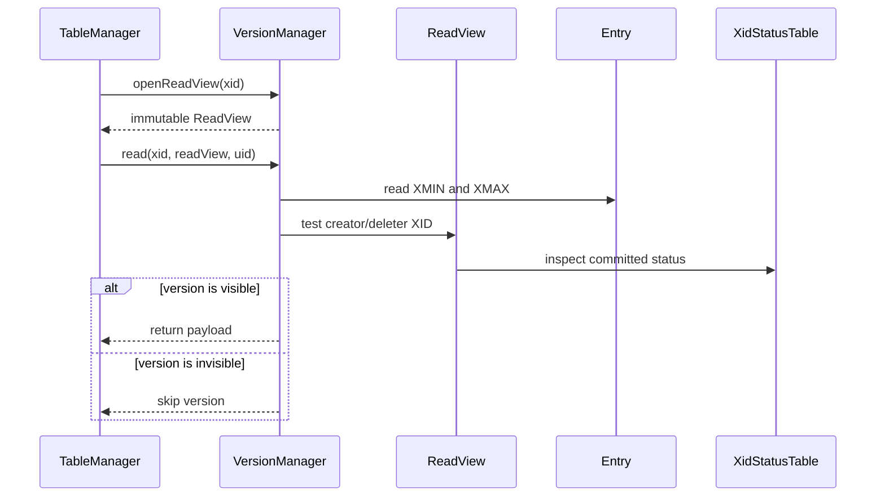
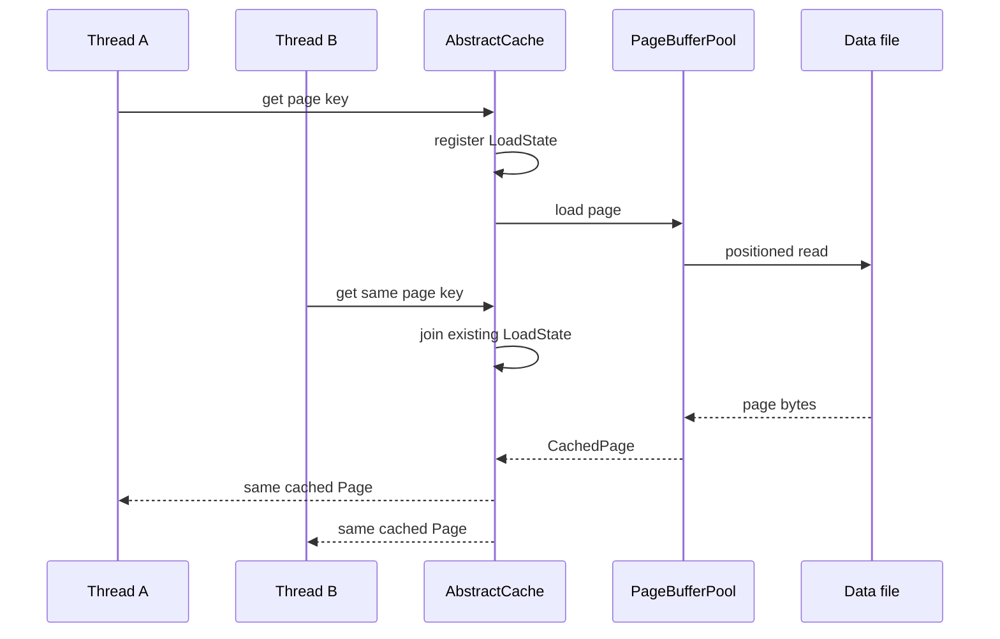
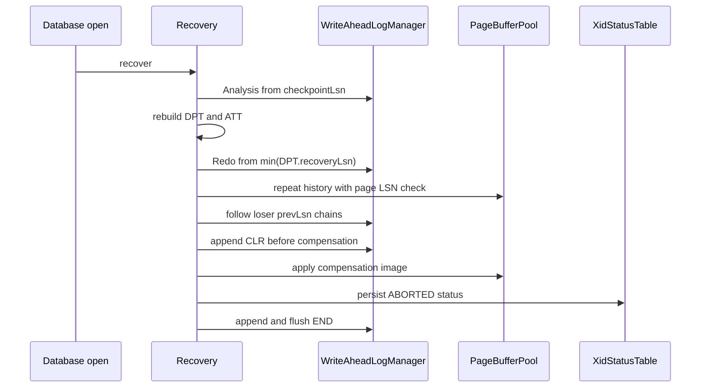
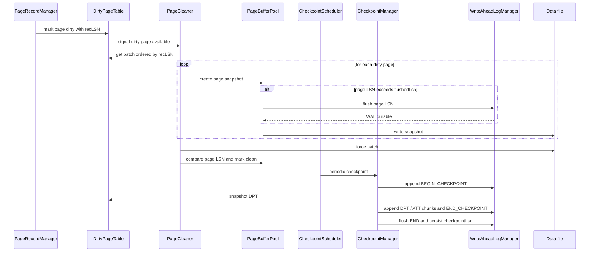

# 6. 运行时视图

## SQL 执行

`Executor` 绑定单个 client connection 的 transaction context。显式 `BEGIN` 保留持久化
XID；没有显式事务时，写语句使用普通 implicit transaction，查询语句使用进程内
read-only transaction。

## 物理修改与 WAL 刷页

page LSN 已持久化在 Page header；Redo 使用完整 record 的 `endLsn` 进行幂等跳过。

## 事务生命周期

### 显式事务

`Executor` 保存 connection-bound XID。连接在 commit 前关闭时，`Executor.close()` 会 abort 该 XID，再释放 `DatabaseContext`。

COMMIT WAL durable 是提交点。事务在此之前仍留在 active transaction table，并持有
全部记录锁；XID 状态切换和移出 active table 与 RR 快照创建使用同一把互斥锁，避免
快照漏掉尚未完成状态切换的事务。`END` 仅用于 Recovery 清理，不决定提交结果。

回滚时先把事务切换为 `ABORTING`，并只取消尚未获得的锁等待。事务已经持有的记录锁
覆盖完整的 Undo / CLR / END 流程，直到 XID 已记录为 `ABORTED` 后才统一释放。这是
基于物理记录 UID 的严格 2PL 记录锁，不是基于业务主键、谓词或索引区间的逻辑行锁。

### 隐式事务

负数 read-only XID 只存在于 `VersionManager.runtimeTransactionMap`，用于标识一次
READ COMMITTED 一致性读；它不会写入 Entry、XID 文件、ATT 或 WAL。显式事务中的
查询仍使用显式事务的持久化 XID 和隔离级别。

## ReadView 与 MVCC visibility

`ReadView` 是不可变值对象，保存 `ownerXid`、创建时的下一 XID
`futureXidBoundary`，以及当时尚未结束的 `activeXids`。版本创建者或删除者：

- 等于 system XID 或 `ownerXid` 时，对当前事务可见；
- 位于 `activeXids`，或不小于 `futureXidBoundary` 时不可见；
- 其余情况只有在 `XidStatusTable` 中为 `COMMITTED` 才可见。

`READ COMMITTED` 在每条 DML/SELECT 语句入口创建一个 ReadView，整条语句的扫描、
过滤、唯一性检查和修改都复用它。`REPEATABLE READ` 在事务开始时创建并保存在
`RuntimeTransaction.readView`，后续语句复用同一视图。快照创建、事务加入或离开
`runtimeTransactionMap` 使用 `VersionManager` 的同一把锁，避免漏记正在提交或回滚
的事务。

## PageBufferPool 并发加载

相同 key 的并发请求共享一次 load；不同 Page key 的 load 不应被 cache-level key lock 串行化。Page 内部 read/write latch 只协调同一页的内存访问。

## Crash recovery

Recovery 从最近完整 fuzzy checkpoint 开始 Analysis。Redo 对 DPT 中可能缺失的
INSERT、UPDATE 与 CLR repeat history，并通过 page LSN 幂等跳过；Undo 使用
按 LSN 降序的 loser queue，CLR 的 `undoNextLsn` 避免重复撤销。

## PageCleaner and checkpoint

`recoveryLsn` 只记录某页从干净变为脏时的第一条 WAL `startLsn`。
Checkpoint snapshot 不停止事务或 PageCleaner；BEGIN 之后发生的并发日志会由
Analysis 顺序扫描并与 snapshot 合并。CheckpointScheduler 与 PageCleaner
相互独立；数据库关闭时先停止调度、刷完脏页，再记录最终 checkpoint。
WAL durable 边界仍由 `flushedLsn` 表示。
